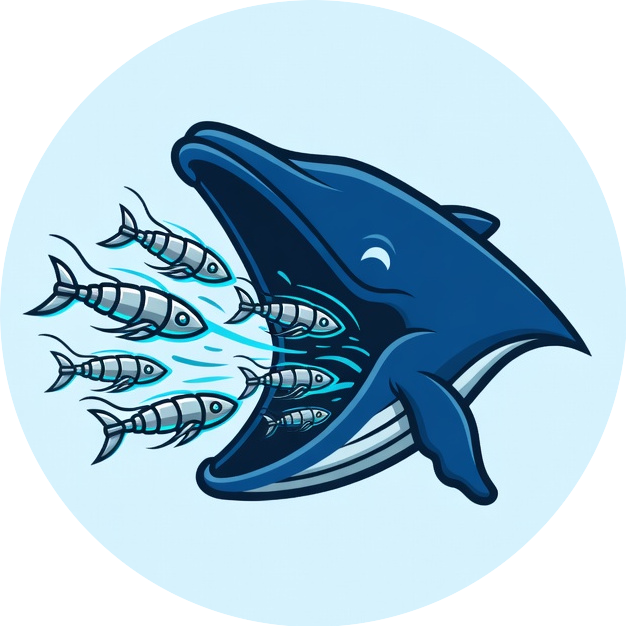

🐋🦐☸️❄️

  

<h1 align="center">OpenKrill</h1>
<h3 align="center">Declarative Kubernetes on NixOS</h3>

  A NixOS module framework for declarative, reproducible Kubernetes clusters. 
  <strong>Pure Nix. One config. Entire platform.</strong>

  <a href="VIBE_CODING_POLICY.md">Vibe Coding Policy</a> &bull;
  <a href="examples/">Examples</a> &bull;
  <a href="https://github.com/general-intelligence-systems/openkrill/issues">Issues</a>

  
  
  
  
  

> [!CAUTION]
> This repository is under active development and is not guaranteed to work.

> [!WARNING]
> Use at your own risk.

> [!NOTE]
> Community contributions are welcome and encouraged — especially from those with Nix experience!
